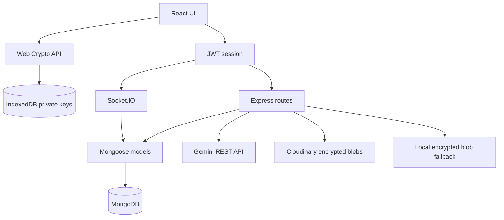

# Architecture

## Components

| Component | Responsibility |
| --- | --- |
| `frontend/` | React UI, JWT session, IndexedDB key storage, Web Crypto, Socket.IO client, local evidence verification |
| `src/index.js` | Canonical Express/HTTP/Socket.IO process and MongoDB connection |
| `src/backend/src/` | CommonJS auth, user, conversation, group, file, KYC, and realtime feature modules |
| `src/routes/` | ESM message-search and Gemini AI routes |
| `src/db/` | Canonical database/search/AI models and query helpers |
| `src/crypto/` | Standalone Node crypto library; not bundled into the browser app |
| `src/ForensisChat.sol` | UUPS forensic room and Merkle-root contract |

## Runtime

`src/index.js` is the only production entry point. `src/backend/server.js` is a compatibility launcher that dynamically imports it. Feature models use `src/backend/src/utils/mongoose.js` so nested dependencies cannot create a second disconnected Mongoose singleton.

## Message Security Flow

1. Each browser device creates an RSA-OAEP key pair and an ECDSA P-256 key pair.
2. Private JWKs are stored in IndexedDB; the public bundle is stored on `User.publicKey`. Users can export a password-encrypted PBKDF2/AES-GCM backup and restore it only to the same account.
3. The client maintains an AES-256-GCM session key per conversation, rotates it in-browser, and uses a fresh 96-bit IV for every message/file.
4. The current session key is RSA-OAEP-SHA256 wrapped for every member inside the envelope so recipients can decrypt after refresh without server plaintext access.
5. The client signs the serialized encrypted envelope and emits it through authenticated Socket.IO.
6. The backend validates envelope shape and verifies that signature against the account's current public key; stale devices receive `KEY_MISMATCH` before persistence or relay.
7. KYC-mode and Privacy-mode ciphertext plus the verified sender public-key snapshot are stored in MongoDB. Privacy-mode ciphertext is also queued per recipient as temporary ciphertext when a recipient is offline or has not opened the conversation.
8. Recipients unwrap/decrypt locally and verify against the message snapshot, falling back to the sender's current public key for legacy records.

At session startup, the frontend compares its IndexedDB public bundle with `/users/me.publicKey` and blocks signing/encryption when they differ. A public-key update notifies online conversation participants to refresh recipient keys. Changing a public key does not re-encrypt history. Password-encrypted backup provides manual multi-device recovery; automatic trusted-device synchronization is not implemented.

## Conversation Search Flow

1. The browser pages through all persisted messages in the selected KYC conversation.
2. It decrypts each text envelope locally in bounded batches.
3. It performs case-insensitive substring matching and displays sender, timestamp, highlighted content, and a jump-to-message action.
4. Undecryptable records are counted and excluded; plaintext is not uploaded for this UI flow.

Privacy conversations search locally decrypted ciphertext history from `Message`; plaintext is never uploaded for this UI flow. The opt-in `MessageSearch` TTL API remains available for compatibility but is not used by the conversation search panel.

## AI Summary Flow

The browser explicitly submits locally decrypted plaintext and message IDs. The backend verifies conversation membership and message metadata, resolves sender IDs to display names/usernames, and builds a transcript prompt without database identifiers. Gemini thinking is disabled for this concise task so the configured output budget remains available for the visible answer. Responses that finish with `MAX_TOKENS` are rejected rather than cached as partial summaries; cache keys include the prompt version and sender labels.

## Forensic Flow

1. The authenticated browser pages through persisted KYC-mode ciphertext and decrypts readable transcript entries locally.
2. It commits deterministic message metadata, ciphertext, and signatures into sorted-pair Keccak-256 Merkle leaves compatible with OpenZeppelin `MerkleProof`.
3. The evidence JSON contains transcript text, signed ciphertext, sender public-key snapshots, leaves, proofs, and the root. Local verification recomputes every leaf/proof and verifies every ECDSA signature.
4. Each conversation has a deterministic bytes32 Room ID. The browser includes it in evidence packages so another reviewer can match imported JSON to the conversation without manually inventing a contract room id.

Transcript plaintext in an exported package is for authorized human review; its integrity is tied indirectly to the included decryptable ciphertext. The package itself must be handled as sensitive evidence.

## KYC Flow

1. Registration remains available without KYC.
2. The browser hashes both CCCD images, combines those hashes with normalized identity fields, hashes the canonical payload, and signs it with the current device key.
3. The backend recomputes the payload/hash, verifies the account public key/signature, and stores both images as authenticated Cloudinary assets or local private fallback files.
4. An allowlisted reviewer receives identity fields plus signed image URLs and records `VERIFIED` or `REJECTED` with audit metadata.
5. KYC direct/group creation, KYC group membership, and KYC-mode sending require every participant to be verified. Privacy mode does not require KYC.

## HTTP Boundaries

| Prefix | Module | Authentication |
| --- | --- | --- |
| `/health`, `/healthz` | Root health | Public |
| `/auth` | Auth routes | Register/login/refresh public; logout JWT |
| `/users`, `/chat`, `/groups`, `/files`, `/kyc` | Feature routes | JWT |
| `/messages` | Temporary search snippets | JWT |
| `/ai` | Gemini moderation/summary | JWT |

## Realtime Boundaries

Socket authentication occurs during the handshake with `auth.token`. Each connection joins its authenticated `user:<id>` room so REST conversation creation and persisted message/file sends can notify members to refresh the canonical conversation list immediately. Room join, send, seen, typing, and missed-message operations verify conversation membership. `user_online` no longer controls identity and cannot impersonate another user. The chat workspace also keeps a small per-user/per-conversation in-memory message cache so switching application tabs does not discard already hydrated messages.

## Data Ownership

| Data | Owner / Storage |
| --- | --- |
| Password hash, account metadata | MongoDB |
| Public encryption/signing keys | MongoDB |
| Private encryption/signing keys | Browser IndexedDB |
| KYC-mode message ciphertext/signature | MongoDB `Message` |
| Privacy-mode message ciphertext/signature | MongoDB `Message`; `PrivacyDelivery` TTL mailbox only for offline/unopened delivery |
| Search plaintext snippet | MongoDB TTL collection, opt-in, 24h |
| AI source plaintext | Request memory only |
| AI summary | MongoDB TTL cache, 1h |
| Encrypted attachment blob | Cloudinary or local private fallback; ciphertext only |
| Authenticated CCCD images | Cloudinary or local private fallback; signed reviewer delivery only |
| Merkle roots/proofs | Browser-generated evidence package; Solidity contract remains in repo for tests/reference |

## Known Architecture Gaps

* Root and feature directories still contain parallel schema declarations; the canonical runtime sharing rule is documented in `docs/database.md`.
* The current frontend does not submit root proposals on-chain; there is no unattended signer or periodic commit worker.
* Messages created before sender public-key snapshots were introduced can still fail signature verification after key rotation; no migration source exists for keys that were already overwritten.
* Refresh tokens are returned to JavaScript because cookie-based session rotation is not implemented.
