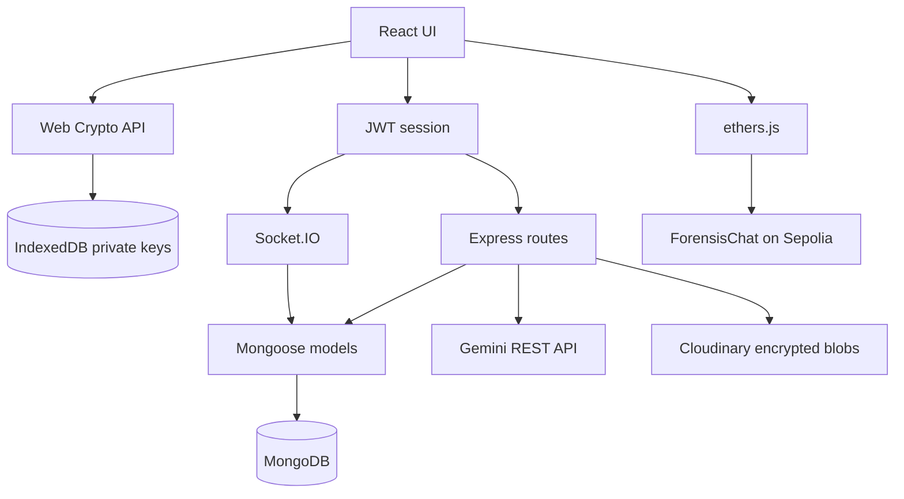

# Architecture

## Components

| Component | Responsibility |
| --- | --- |
| `frontend/` | React UI, JWT session, IndexedDB key storage, Web Crypto, Socket.IO client, ethers proof verification |
| `src/index.js` | Canonical Express/HTTP/Socket.IO process and MongoDB connection |
| `src/backend/src/` | CommonJS auth, user, conversation, group, file, KYC, and realtime feature modules |
| `src/routes/` | ESM message-search and Gemini AI routes |
| `src/db/` | Canonical database/search/AI models and query helpers |
| `src/crypto/` | Standalone Node crypto library; not bundled into the browser app |
| `src/ForensisChat.sol` | UUPS forensic room and Merkle-root contract |

## Runtime

`src/index.js` is the only production entry point. `src/backend/server.js` is a compatibility launcher that dynamically imports it. Feature models use `src/backend/src/utils/mongoose.js` so nested dependencies cannot create a second disconnected Mongoose singleton.

## Message Security Flow

1. Each browser device creates an RSA-OAEP key pair and an ECDSA P-256 key pair.
2. Private JWKs are stored in IndexedDB; the public bundle is stored on `User.publicKey`.
3. Before sending text, the client explicitly calls AI moderation with plaintext.
4. The client creates a random AES-256-GCM key, encrypts content, and RSA-wraps that AES key for every member.
5. The client signs the serialized encrypted envelope and emits it through authenticated Socket.IO.
6. KYC-mode ciphertext is stored in MongoDB. Privacy-mode ciphertext is relayed only.
7. Recipients unwrap/decrypt locally and verify the sender signature against the published key.

Changing a public key does not re-encrypt history. Multi-device key transfer is not implemented.

## HTTP Boundaries

| Prefix | Module | Authentication |
| --- | --- | --- |
| `/health`, `/healthz` | Root health | Public |
| `/auth` | Auth routes | Register/login/refresh public; logout JWT |
| `/users`, `/chat`, `/groups`, `/files`, `/kyc` | Feature routes | JWT |
| `/messages` | Temporary search snippets | JWT |
| `/ai` | Gemini moderation/summary | JWT |

## Realtime Boundaries

Socket authentication occurs during the handshake with `auth.token`. Room join, send, seen, typing, and missed-message operations verify conversation membership. `user_online` no longer controls identity and cannot impersonate another user.

## Data Ownership

| Data | Owner / Storage |
| --- | --- |
| Password hash, account metadata | MongoDB |
| Public encryption/signing keys | MongoDB |
| Private encryption/signing keys | Browser IndexedDB |
| KYC-mode message ciphertext/signature | MongoDB |
| Privacy-mode ciphertext | In transit only |
| Search plaintext snippet | MongoDB TTL collection, opt-in, 24h |
| AI source plaintext | Request memory only |
| AI summary | MongoDB TTL cache, 1h |
| Encrypted attachment blob | Cloudinary |
| Merkle confirmed roots | Solidity contract |

## Known Architecture Gaps

* Root and feature directories still contain parallel schema declarations; the canonical runtime sharing rule is documented in `docs/database.md`.
* There is no worker connecting MongoDB message logs to periodic on-chain Merkle commits.
* There is no evidence export/proof-generation service.
* Refresh tokens are returned to JavaScript because cookie-based session rotation is not implemented.
