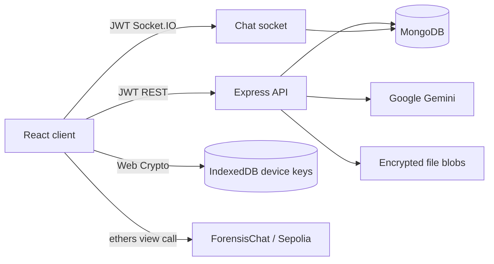

# Project Context

## Purpose

Secure Chat Forensics is an educational secure messaging platform that combines client-side encrypted chat, MongoDB metadata persistence, AI-assisted moderation/summaries, and blockchain-backed forensic verification.

Code is the source of truth. Requirement documents describe planned scope and must not be treated as implemented behavior.

## Current State

| Area | State | Primary Location |
| --- | --- | --- |
| Frontend | Implemented React/Vite/Tailwind app | `frontend/` |
| Backend | One canonical Express/Socket.IO runtime | `src/index.js` |
| Feature APIs | Auth, users, chat, groups, files, KYC | `src/backend/src/` |
| Database/Search | Mongoose models, indexes, TTL search snippets | `src/db/` |
| AI | Gemini moderation and opt-in summary | `src/routes/ai.js`, `src/services/` |
| Crypto | Browser Web Crypto plus standalone Node module | `frontend/src/lib/crypto.js`, `src/crypto/` |
| Blockchain | Foundry contract, deployment script, tests | `src/ForensisChat.sol`, `script/`, `test/` |
| DevOps | Backend/frontend images, Compose, CI, Render backend trigger | `Dockerfile`, `frontend/Dockerfile`, `.github/` |

## Runtime Summary



The browser creates RSA-OAEP and ECDSA P-256 keys. Message/file content is AES-GCM encrypted; the AES key is wrapped for each conversation member. Only public key bundles are uploaded. KYC mode persists ciphertext; Privacy mode relays ciphertext without creating a `Message` record.

## Implemented User Flows

| Flow | Status |
| --- | --- |
| Register, login, refresh, logout, temporary account lock | Implemented |
| Local device identity and public-key publication | Implemented |
| User search, profile update, block/unblock | Implemented |
| Direct conversations and group administration | Implemented |
| Conversation sidebar listing | `GET /chat/conversations`; compatibility `GET /groups/all` |
| JWT-authenticated realtime encrypted chat | Implemented |
| Delivered/seen, typing, missed-message recovery | Implemented |
| Encrypted attachment upload/download | Implemented; requires Cloudinary |
| Opt-in 24-hour search snippets | Implemented; disabled by default in UI |
| Gemini moderation before encryption | Implemented with allow-on-provider-failure policy |
| Gemini conversation summary | Implemented only for explicit client-supplied plaintext |
| KYC proof submission | Implemented as `PENDING`; reviewer workflow is missing |
| On-chain Merkle proof verification | Implemented in frontend when contract address/proof are supplied |

## Technical Constraints

| Constraint | Handling |
| --- | --- |
| Primary message plaintext must not reach MongoDB | `Message` stores encrypted envelopes and signatures only |
| Browser private keys must not reach backend | Stored in IndexedDB; API receives public bundle only |
| Search and AI need plaintext | Explicit client opt-in; snippets expire after 24h; AI source plaintext is not stored |
| Feature models must use canonical DB connection | CommonJS models resolve the root Mongoose singleton through `utils/mongoose.js` |
| Existing database contracts must remain readable | Canonical models accept the existing collection names and preserve existing fields |
| Backend syntax CI must inspect owned source only | Checks `src/backend/server.js` and `src/backend/src`; dependency bundles are excluded |
| Frontend production target is not selected | CI builds the image; deployment remains unconfigured |

## Remaining Work / Blockers

| Area | Gap |
| --- | --- |
| KYC | No reviewer/admin API, document provider, rejection workflow, or verified-at authority |
| Forensics | No backend proof generation, periodic root commit worker, dispute API, or evidence export package |
| Multi-device crypto | No private-key backup/recovery or trusted-device transfer |
| Privacy mode | Ephemeral delivery has no offline recovery by design |
| Attachments | Requires Cloudinary credentials and browser CORS access to encrypted blobs |
| Deployment | Backend Render secrets and a frontend hosting target must be configured externally |
| Operations | No Atlas automation, secret rotation workflow, metrics, tracing, or centralized logs |
| Dependency lock | `frontend/package-lock.json` has not been generated in this environment; CI currently installs from pinned semver ranges |

## Validation Entry Points

```bash
npm ci
npm ci --prefix src/backend
npm test
npm install --prefix frontend
npm --prefix frontend run check
docker compose config
docker compose build
forge test
```

## Future Session Startup

1. Read `AGENTS.md`.
2. Read this file, `docs/changelog.md`, and `docs/decisions.md`.
3. Read only task-relevant docs and source.
