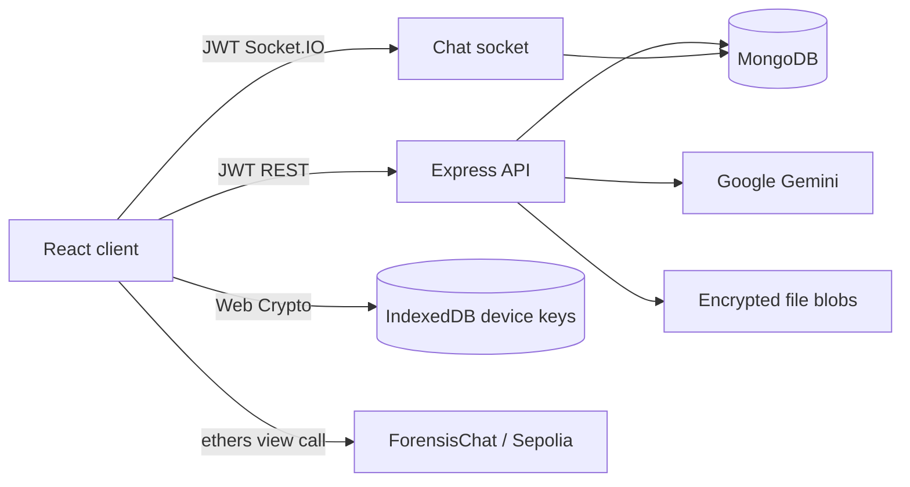

# Project Context

## Purpose

Secure Chat Forensics is an educational secure messaging platform that combines client-side encrypted chat, MongoDB metadata persistence, AI-assisted moderation/summaries, and blockchain-backed forensic verification.

Code is the source of truth. Requirement documents describe planned scope and must not be treated as implemented behavior.

## Current State

| Area | State | Primary Location |
| --- | --- | --- |
| Frontend | Implemented React/Vite/Tailwind app | `frontend/` |
| Backend | One canonical Express/Socket.IO runtime | `src/index.js` |
| Feature APIs | Auth, users, chat, groups, files, KYC | `src/backend/src/` |
| Database/Search | Mongoose models, indexes, TTL search snippets | `src/db/` |
| AI | Gemini moderation and opt-in summary | `src/routes/ai.js`, `src/services/` |
| Crypto | Browser Web Crypto plus standalone Node module | `frontend/src/lib/crypto.js`, `src/crypto/` |
| Blockchain | Foundry contract deployed through an ERC1967 proxy on Sepolia | `src/ForensisChat.sol`, `script/`, `broadcast/`, `test/` |
| DevOps | Backend/frontend images, Compose, CI, Render production services | `Dockerfile`, `frontend/Dockerfile`, `.github/` |

## Runtime Summary



The browser creates RSA-OAEP and ECDSA P-256 keys. Message/file content is AES-GCM encrypted; the AES key is wrapped for each conversation member. Only public key bundles are uploaded. The client detects local/server key mismatch and the backend rejects stale signatures. KYC mode persists ciphertext plus a sender-key snapshot; Privacy mode relays ciphertext without creating a `Message` record.

## Implemented User Flows

| Flow | Status |
| --- | --- |
| Register with password confirmation, case-insensitive username/email login, refresh, logout, temporary account lock | Implemented |
| Local device identity and public-key publication | Implemented |
| User search, profile update, block/unblock | Implemented |
| Mode-specific direct conversations and group administration | Implemented |
| Realtime conversation sidebar listing | HTTP canonical list plus invited/member message Socket.IO refresh signals |
| JWT-authenticated realtime encrypted chat | Implemented |
| Delivered/seen, typing, missed-message recovery | Implemented |
| Encrypted attachment upload/download | Implemented; requires Cloudinary |
| Conversation message search | Full persisted history is decrypted and substring-searched locally; sender/time/jump results implemented |
| Gemini moderation before encryption | Implemented with allow-on-provider-failure policy |
| Gemini conversation summary | Explicit client-supplied plaintext, human sender labels, versioned cache, and truncated-response rejection implemented |
| Manual KYC review | Signed CCCD fields/images, private upload, allowlisted review, resubmission, and KYC-mode enforcement implemented |
| KYC verified account badge | Implemented in profile, user search, conversation list, chat header, message sender labels, and local search results when `kycStatus` is `VERIFIED` |
| Device-key recovery | Password-encrypted local export/import implemented; no server key custody |
| Forensic evidence | Local transcript package, Merkle proof/signature verification, room/root wallet actions implemented |

## Technical Constraints

| Constraint | Handling |
| --- | --- |
| Primary message plaintext must not reach MongoDB | `Message` stores encrypted envelopes and signatures only |
| Browser private keys must not reach backend | Stored in IndexedDB; API receives public bundle only |
| Search and AI need plaintext | Conversation search decrypts locally without uploading plaintext; legacy snippet API remains opt-in/24h; AI source plaintext is not stored |
| Feature models must use canonical DB connection | CommonJS models resolve the root Mongoose singleton through `utils/mongoose.js` |
| Existing database contracts must remain readable | Canonical models accept the existing collection names and preserve existing fields |
| Backend syntax CI must inspect owned source only | Checks `src/backend/server.js` and `src/backend/src`; dependency bundles are excluded |
| Render production is manually provisioned | API and static frontend deploy from `main`; secrets remain outside Git |

## Remaining Work / Blockers

| Area | Gap |
| --- | --- |
| KYC | Manual document review exists; OCR, liveness, government lookup, and external eKYC provider are not integrated |
| Forensics | No unattended periodic root worker; wallet approval is required to avoid a server custody key |
| Multi-device crypto | Local/server mismatch detection and encrypted manual recovery exist; no automatic trusted-device transfer, and legacy messages have no key snapshots |
| Privacy mode | Ephemeral delivery has no offline recovery by design; the frontend keeps only a browser-session message cache for tab switching |
| Attachments | Production Cloudinary is configured; local and future environments still require credentials and browser access to encrypted blobs |
| Deployment | API, frontend, Atlas, Gemini, Cloudinary, Sepolia proxy, KYC reviewer allowlist, and GitHub-to-Render deploy secrets are configured |
| Operations | No Atlas automation, secret rotation workflow, metrics, tracing, or centralized logs |

## Validation Entry Points

```bash
npm ci
npm ci --prefix src/backend
npm test
npm install --prefix frontend
npm --prefix frontend run check
docker compose config
docker compose build
forge test
```

## Future Session Startup

1. Read `AGENTS.md`.
2. Read this file, `docs/changelog.md`, and `docs/decisions.md`.
3. Read only task-relevant docs and source.
